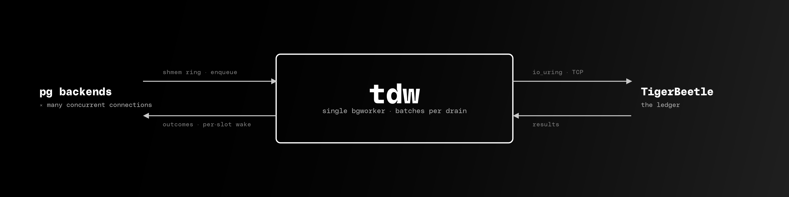

# tdw

A SQL interface to [TigerBeetle](https://tigerbeetle.com/), packaged as a [PostgreSQL extension](https://www.postgresql.org/docs/current/extend-extensions.html).

TigerBeetle is a great ledger and a terrible general-purpose database. Postgres is the opposite. `tdw` puts a thin SQL surface in front of TB so you can keep your accounts and transfers in TB while joining them against your own users, orders, and invoices in plain SQL. A single background worker inside Postgres batches every backend's requests into one TB client, so each connection pays for a shared-memory enqueue, not its own TCP socket.

You write either:

```sql
SELECT transfers.post(gen_random_uuid(), alice, bob, 1000, 1, 10);
SELECT * FROM tb_transfers WHERE debit_account_id = alice;
```

and `tdw` routes both to TB.

## Requirements

- PostgreSQL 15, 16, 17, or 18
- A running TigerBeetle cluster
- `shared_preload_libraries = 'tdw'` in `postgresql.conf`

## Quick start

The bundled `compose.yml` runs a single-replica TB cluster, a Postgres 18 image with `tdw` preloaded, and a smoke/bench runner.

```bash
docker compose up -d postgres
psql -h localhost -p 28819 -U postgres -d tdw -f sql/smoke.sql
```

Run the bundled pgbench profile:

```bash
CLIENTS=128 DURATION=60 docker compose run --rm bench
```

## Install (from release tarball)

Tagged releases ship prebuilt bundles on the [Releases page](https://github.com/CoreValence/tdw/releases), one per Postgres major (15-18) and arch (amd64, arm64):

```
tdw-pg<major>-linux-<arch>.tar.gz
```

The tarball uses Debian's standard Postgres layout (`/usr/lib/postgresql/<major>/lib/` for `.so`, `/usr/share/postgresql/<major>/extension/` for `.control` and `.sql`). On Debian/Ubuntu with PGDG packages, extract from the filesystem root:

```bash
sudo tar xzf tdw-pg18-linux-amd64.tar.gz -C /
```

For a non-Debian install, check `pg_config --pkglibdir` and `pg_config --sharedir` and move the extracted files into those directories.

The amd64 bundle has two shared libraries: `tdw.so` and `libtb_client.so`. Keep them in the same directory; `tdw.so` resolves `libtb_client.so` via `$ORIGIN`. arm64 bundles only ship `tdw.so` (TigerBeetle's client links statically on that arch).

In `postgresql.conf`:

```ini
shared_preload_libraries = 'tdw'
tdw.tb_addr              = '172.30.0.10:3000'   # comma-separate for multi-replica
tdw.tb_cluster_id        = '1'
```

Restart Postgres, then per database:

```sql
CREATE EXTENSION tdw;
```

## Docker

Two-line image:

```dockerfile
FROM postgres:18-bookworm
ADD https://github.com/CoreValence/tdw/releases/download/v0.1.0/tdw-pg18-linux-amd64.tar.gz /tmp/tdw.tgz
RUN tar xzf /tmp/tdw.tgz -C / && rm /tmp/tdw.tgz
```

Swap the Postgres major (`15`-`18`) and arch (`amd64`, `arm64`) in both the `FROM` and the tarball filename.

Run against an existing TigerBeetle cluster:

```bash
docker build -t tdw:pg18 .
docker run --rm \
  --security-opt seccomp=unconfined \
  -e POSTGRES_HOST_AUTH_METHOD=trust \
  -e POSTGRES_DB=tdw \
  -p 5432:5432 \
  tdw:pg18 \
  postgres \
    -c shared_preload_libraries=tdw \
    -c tdw.tb_addr=10.0.0.10:3000 \
    -c tdw.tb_cluster_id=1
```

`seccomp=unconfined` is required because TigerBeetle's Zig client uses `io_uring` for TCP, and Docker's default seccomp profile blocks it.

For the full multi-service setup (TB + Postgres built from source), use the bundled `compose.yml` and `Dockerfile`.

## Configuration

Standard Postgres GUCs.

| GUC                 | Context    | Default | Description                                                                                         |
| ------------------- | ---------- | ------- | --------------------------------------------------------------------------------------------------- |
| `tdw.tb_addr`       | Postmaster | `3000`  | Comma-separated TB replica addresses (`port`, `ip:port`, or `host:port`). Resolved at worker start. |
| `tdw.tb_cluster_id` | Postmaster | `0`     | TigerBeetle cluster id (u128, decimal). Must match the value the replica was formatted with.        |
| `tdw.batch_wait_ms` | Sighup     | `1`     | Worker idle wait between drains, ms. Lower means lower latency, higher means bigger batches.        |
| `tdw.batch_max`     | Sighup     | `8189`  | Max slots drained per TB request. Capped by TB's 8189-per-message limit.                            |

## Usage

A round-trip: open two accounts, move money, read the balances back.

```sql
CREATE EXTENSION tdw;

DO $$
DECLARE
    alice uuid := gen_random_uuid();
    bob   uuid := gen_random_uuid();
    xfer  uuid;
BEGIN
    PERFORM accounts.open(alice, 1, 100);
    PERFORM accounts.open(bob,   1, 100);
    xfer := transfers.post(gen_random_uuid(), alice, bob, 1000, 1, 10);
    RAISE NOTICE 'transfer %', xfer;
END $$;

SELECT debits_posted, credits_posted, ledger, code FROM accounts.get(alice);
--  debits_posted | credits_posted | ledger | code
-- ---------------+----------------+--------+------
--           1000 |              0 |      1 |  100
```

Per-transfer balance snapshots (set the TB `HISTORY` flag = 8 at account creation):

```sql
PERFORM accounts.open(alice, 1, 100, 8);
-- post a few transfers against alice
SELECT timestamp, debits_posted, credits_posted FROM accounts.history(alice) LIMIT 10;
```

Account-scoped transfer history with TB flags (`DEBITS = 1`, `CREDITS = 2`):

```sql
SELECT id, credit, amount FROM accounts.ledger(alice, 50, 1);  -- outgoing only
```

Global scan by ledger/code:

```sql
SELECT id, debit, credit, amount FROM transfers.search(1, 10, 100);
```

## SQL API

Client-provided ids are the idempotency primitive. Re-posting a transfer with the same id returns the existing row instead of creating a duplicate (TB's `exists` error). Generate them with `gen_random_uuid()`.

All functions live in `accounts` or `transfers`.

```sql
-- accounts ─────────────────────────────────────────────────────────────────

-- Create an account. flags is the raw TB bitfield (HISTORY = 8, LINKED = 1).
accounts.open(id uuid, ledger int, code int, flags int default 0) → uuid

-- Lookup. Returns 0 rows if not found.
accounts.get(id uuid) → table(...)

-- Account-scoped history. flags: DEBITS(1) | CREDITS(2) | REVERSED(4).
accounts.ledger (account_id uuid, limit int default 10, flags int default 3) → setof record
accounts.history(account_id uuid, limit int default 10, flags int default 3) → setof record

-- Query by coordinate.
accounts.search(ledger int default 0, code int default 0, limit int default 10, flags int default 0) → setof record

-- transfers ────────────────────────────────────────────────────────────────

transfers.post(id uuid, debit uuid, credit uuid, amount bigint, ledger int, code int,
               flags int default 0) → uuid

-- Two-phase: reserve, then capture or release. NULL amount on capture takes
-- the full held amount; a smaller amount captures partial and auto-releases
-- the rest.
transfers.hold   (id uuid, debit uuid, credit uuid, amount bigint, ledger int, code int) → uuid
transfers.capture(id uuid, pending_id uuid, amount bigint default NULL) → uuid
transfers.release(id uuid, pending_id uuid) → uuid

-- Sweep: TB caps the amount at the counterparty's available balance, so you
-- can say "move up to this much" and TB does the math.
transfers.sweep_from(id uuid, debit uuid, credit uuid, amount bigint, ledger int, code int) → uuid
transfers.sweep_to  (id uuid, debit uuid, credit uuid, amount bigint, ledger int, code int) → uuid

-- Atomic chain in one TB call. Each leg is a JSON object:
--   {"id":uuid, "debit":uuid, "credit":uuid, "amount":int, "ledger":int, "code":int,
--    "pending_id"?:uuid, "flags"?:int}
-- The LINKED flag is applied automatically; all legs commit or none do.
transfers.journal(legs jsonb) → uuid[]

-- N-way percent split. Percentages sum to exactly 100; floor-division dust
-- goes to remainder_to.
transfers.split(source uuid, destinations jsonb, total bigint, ledger int, code int,
                remainder_to uuid) → uuid[]

-- Mixed fixed/percent/remainder fan-out. Each entry is exactly one of:
-- {"to":uuid,"amount":int} | {"to":uuid,"pct":int} | {"to":uuid,"remainder":true}.
-- At most one remainder. Atomic LINKED chain.
transfers.allocate(source uuid, destinations jsonb, total bigint, ledger int, code int) → uuid[]

-- Fallback cascade: pull `total` from sources in order, each contributing up
-- to its `max` cap. Entries: {"from":uuid,"max":int|null}; max=null drains
-- the source's available balance. Errors if the caps don't cover the total.
transfers.waterfall(destination uuid, sources jsonb, total bigint, ledger int, code int) → uuid[]

-- Lookup. Returns 0 rows if not found.
transfers.get(id uuid) → table(...)

transfers.search(ledger int default 0, code int default 0, limit int default 10, flags int default 0) → setof record

-- Post an opposite-direction transfer referencing an original. Same amount,
-- ledger, code; debit/credit swapped. Rejects two-phase originals; use
-- transfers.release / transfers.capture for those.
transfers.reverse(id uuid, original_id uuid) → uuid
```

`sql/smoke.sql` exercises every function.

## FDW: TigerBeetle as SQL tables

The functions above are the imperative path. For ad-hoc queries and joins against your own tables, `tdw` also exposes TB as three foreign tables. This is the part that makes "JOIN ledger against your existing schema in one query" actually work.

```sql
\i sql/fdw.sql  -- creates the server `tb_default` and three foreign tables
```

| Table                 | What                                                     | Writes        |
| --------------------- | -------------------------------------------------------- | ------------- |
| `tb_accounts`         | Every TB account (immutable identity + running counters) | `INSERT` only |
| `tb_transfers`        | Append-only transfer journal                             | `INSERT` only |
| `tb_account_balances` | Per-account balance snapshots (HISTORY-flagged accounts) | read-only     |

Reads push down on the columns TB has native filters for. Anything else falls back to local Postgres filtering. The planner picks the most selective predicate:

```sql
WHERE id = $1                   -- LOOKUP_ACCOUNT / LOOKUP_TRANSFER
WHERE debit_account_id  = $1    -- GET_ACCOUNT_TRANSFERS (debit side)
WHERE credit_account_id = $1    -- GET_ACCOUNT_TRANSFERS (credit side)
WHERE ledger = $1 AND code = $2 -- QUERY_ACCOUNTS / QUERY_TRANSFERS
```

Pushdown works for `Const`, prepared-statement `Param`, and outer-relation `Var`s on parameterized paths. That last one is the real win: correlated joins do per-row TB lookups instead of full-cluster scans.

```sql
-- "for each user in org 42, give me their transfers"
SELECT u.email, t.id, t.amount
FROM users u
JOIN tb_transfers t ON t.debit_account_id = u.account_uuid
WHERE u.org_id = 42;
-- plan: Nested Loop → Foreign Scan with Beetle Op: GET_ACCOUNT_TRANSFERS
```

Multi-row reads paginate transparently across TB round-trips. `LIMIT N` returns at most N. No `LIMIT` returns every matching row, same as a vanilla Postgres table; use `statement_timeout` if you want a bound on long scans.

Inserts go through the same shmem ring as the branded API:

```sql
INSERT INTO tb_accounts (id, ledger, code, debits_posted, credits_posted,
                         debits_pending, credits_pending, flags, "timestamp")
VALUES (gen_random_uuid(), 1, 100, 0, 0, 0, 0, 0, 0);

-- multi-row inserts pack into one TB call as a LINKED batch
INSERT INTO tb_transfers (id, debit_account_id, credit_account_id, amount,
                          ledger, code, flags, "timestamp", pending_id)
VALUES (gen_random_uuid(), :alice, :bob, 100, 1, 10, 0, 0, NULL),
       (gen_random_uuid(), :alice, :bob, 200, 1, 10, 0, 0, NULL);
```

`UPDATE` and `DELETE` aren't supported. TB is append-only by design.

## Architecture



Each `accounts.*` or `transfers.*` call packs its request into a fixed-size slot in the shared-memory ring, wakes the worker, and waits on a per-slot condvar for the outcome. The worker drains up to `batch_max` slots per TB round-trip.

## Roadmap

- [ ] **Split the worker into one reader and one writer.** Writes want big batches; reads (`LOOKUP_*`, `GET_ACCOUNT_*`) don't batch and just want low latency. The current single worker forces them into the same drain cycle. A 1R/1W split lets them stop interfering. Worth doing once correlated FDW joins fan out enough per-row lookups to push worker CPU.

## Development

Build against a specific Postgres major:

```bash
cargo pgrx init --pg18 $(which pg_config)
cargo pgrx run pg18
```

Package an installable bundle:

```bash
cargo pgrx package --features pg18 --pg-config $(which pg_config)
```

The CI matrix in `.github/workflows/release.yml` builds `pg15..pg18 × {amd64, arm64}` tarballs and attaches them to tagged releases.

## License

TBD.
